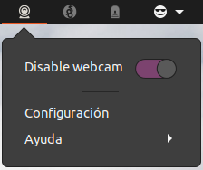
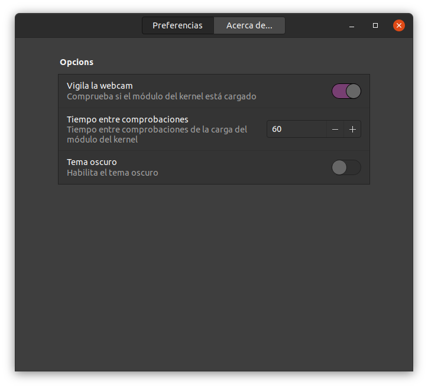
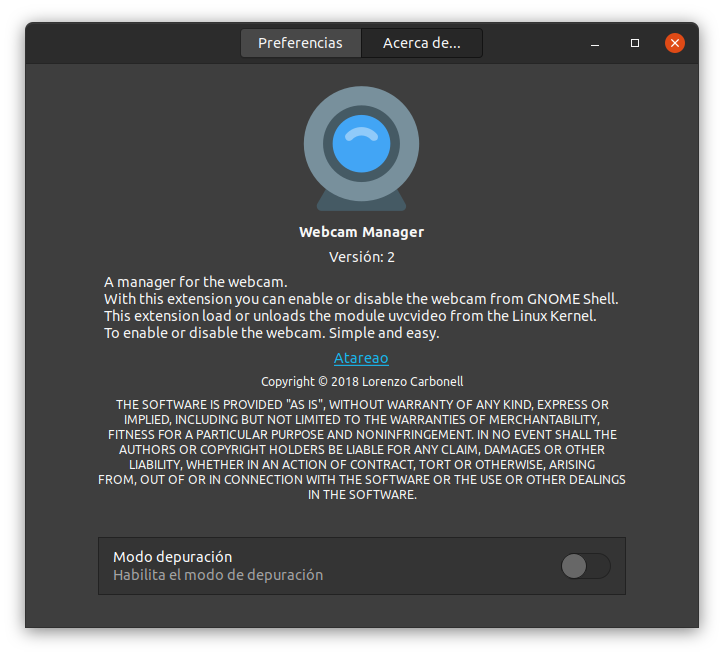

<!-- start project-info -->
<!--
project_title: Webcam Manager
github_project: https://github.com/atareao/webcam-manager
license: MIT
icon: /datos/Sync/Programacion/gnome-shell/webcam-manager@atareao.es/icons/webcam-manager.svg
homepage: https://www.atareao.es/aplicacion/desactivar-tu-webcam/
license-badge: True
contributors-badge: True
lastcommit-badge: True
codefactor-badge: True
--->

<!-- end project-info -->

<!-- start badges -->

<!-- end badges -->

<!-- start description -->
<h1 align="center">Welcome to Webcam Manager 👋</h1>

<h2>🏠 <a href="https://www.atareao.es/aplicacion/desactivar-tu-webcam/" id="homepage">Homepage</a></h2>

With Webcam Manager you can enable or disable the webcam from GNOME Shell.

### How it works?
This extension unloads the module `uvcvideo` from the Linux Kernel. **Simple and easy**.
<!-- end description -->

<!-- start prerequisites -->
## Prerequisites

GNOME Shell

<!-- end prerequisites -->

<!-- start installing -->
## Installing Webcam Manager

Install the extension from <a href="https://extensions.gnome.org/extension/1477/webcam-manager/">GNOME Shell extensions</a>

<!-- end installing -->

<!-- start using -->
## Using Webcam Manager

When you start **Webcam Manager** it goes to Indicator Area, as you can see in the next screenshot,

In this screenshot, the language is Spanish, but, if there is no translation for your language, you will find the app in English.

You can set some options in order to start Webcam Manager when you start your Operative System.

* You decide if monitor the module of webcam from kernel
* Time between tests
* Theme of the icons

You can enable the debug mode

<!-- end using -->

<!-- start contributing -->
## Contributing to Webcam Manager

To contribute to **Webcam Manager**, follow these steps:

1. Fork this repository.
2. Create a branch: `git checkout -b <branch_name>`.
3. Make your changes and commit them: `git commit -m '<commit_message>'`
4. Push to the original branch: `git push origin atareao/webcam-manager`
5. Create the pull request.

Alternatively see the GitHub documentation on [creating a pull request](https://help.github.com/en/github/collaborating-with-issues-and-pull-requests/creating-a-pull-request).
</commit_message></branch_name>

<!-- end contributing -->

<!-- start contributors -->
## 👤 Contributors ✨

Thanks goes to these wonderful people ([emoji key](https://allcontributors.org/docs/en/emoji-key)):

<!-- end contributors -->

<!-- start table-contributors -->

<table id="contributors">
	<tr id="info_avatar">
		<td id="atareao" align="center">
			
		</td>
	</tr>
	<tr id="info_name">
		<td id="atareao" align="center">
			<a href="https://github.com/atareao">
				<strong>Lorenzo Carbonell</strong>
			</a>
		</td>
	</tr>
	<tr id="info_commit">
		<td id="atareao" align="center">
			<a href="/commits?author=atareao">
				💻
			</a>
		</td>
	</tr>
</table>
<!-- end table-contributors -->
